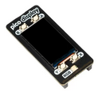

# HAM IBP Monitor
with Raspberry Pi PicoW with CircuitPython and Pimoroni pico display pack

## Introduction
This is a spinoff of my Windows HAM IBP Monitor project.

**IBP = International Beacon Project**  See https://www.ncdxf.org/beacon/

The beacons are transmitting on the shortwave frequencies 14.100, 18.110, 21.150, 24.930 and 28.200 MHz.
* Each beacon transmits once on each band once every three minutes, 24 hours a day.
* A transmission consists of the callsign of the beacon sent at 22 words per minute followed by four one-second dashes.
* The callsign and the first dash are sent at 100 watts. The remaining dashes are sent at 10 watts, 1 watt and 100 milliwatts.
* At the end of each 10 second transmission, the beacon steps to the next higher band and the next beacon in the sequence begins transmitting.

The goal is to show the actual transmitting HF becon on a display, attached to a Raspberry Pi PicoW.
For this, I use the Pimoroni pico display pack 

## Hardware and software in this project
* Raspberry Pi PicoW
* CircuitPyton (https://circuitpython.org/board/raspberry_pi_pico_w/)
* Pimoroni pico display pack (https://shop.pimoroni.com/products/pico-display-pack)

* The PicoW has to be connected to a Wi-Fi network to grab the actual time from a NTP server.

The first version will have the list of stations hardcoded as a dictionary in the source. It does not change very often.

        beacons = {
            0  : 4U1UN, New York City, United Nations, FN30as",
            1  : "VE8AT, Inuvik NT, Canada, CP38gh",
            2  : "W6WX, Mt. Umunhum, United States, CM97bd",
            3  : "KH6RS, Maui, Hawaii, BL10ts",
            4  : "ZL6B, Masterton, New Zealand, RE78tw",
            5  : "VK6RBP, Rolystone, Australia, OF87av",
            6  : "JA2IGY, Mt. Asama, Japan, PM84jk",
            7  : "RR9O, Novosibirsk, Russia, NO14kx",
            8  : "VR2B, Hong Kong, Hong Kong, OL72bg",
            9  : "4S7B, Colombo, Sri Lanka, MJ96wv",
            10 : "ZS6DN, Pretoria, South Africa, KG33xi",
            11 : "5Z4B, Kariobangi, Kenya, KI88ks",
            12 : "4X6TU, Tel Aviv, Israel, KM72jb",
            13 : "OH2B, Lohja, Finland, KP20eh",
            14 : "CS3B, São Jorge, Madeira, IM12mt",
            15 : "LU4AA, Buenos Aires, Argentina, GF05tj",
            16 : "OA4B, Lima, Peru, FH17mw",
            17 : "YV5B, Caracas, Venezuela, FJ69cc",
        }

The application will not attempt to do calculations on the distance and bearing of the beacons.
It will just show the callsign and the cityname or country.

## MU editor — Software development notes 

* The PicoW is connected to the PC using USB, and is seen as drive G: with as name CIRCUITPY.
* Editing is done on the PicoW using the Mu editor V1.2.0 (https://codewith.mu/)
* As soon as CTRL-S is used to save a changed file, the PicoW is automatically rebooted.
* Backup of the code from the PicoW is done with a batchfile containg the command

    `XCOPY /s /e /y /z g:\* .\src`

## PyCharm — Software development notes

See https://learn.adafruit.com/welcome-to-circuitpython/pycharm-and-circuitpython